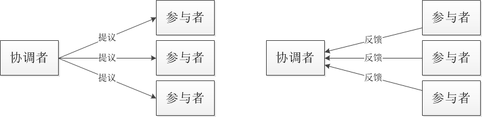
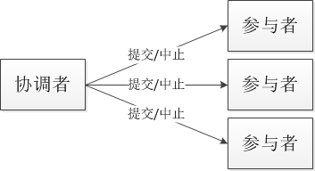
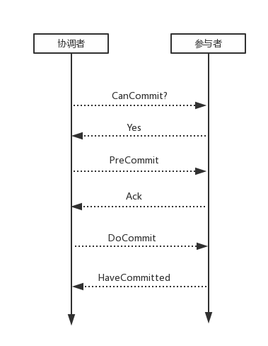

## **2PC**

### **1.1 简述**

2PC(tow phase commit)两阶段提交。

所谓的两个阶段是指：第一阶段：准备阶段(投票阶段)和第二阶段：提交阶段（执行阶段）。

我们将提议的节点称为协调者(coordinator)，其他参与决议节点称为参与者(participants, 或cohorts)。

### **1.2 阶段1**

在阶段1中，协调者发起一个提议，分别问询各参与者是否接受，如下图：

### **1.3 阶段2**

在阶段2中，协调者根据参与者的反馈，提交或中止事务，如果参与者全部同意则提交，只要有一个参与者不同意就中止。

如下图：

### **1.4 优缺点**

在异步环境并且没有节点宕机的模型下，2PC可以满足全认同、值合法、可结束，是解决一致性问题的一种协议。从协调者接收到一次事务请求、发起提议到事务完成，经过2PC协议后增加了2次RTT(propose+commit)，带来的时延增加相对较少。

**二阶段提交有几个缺点：**

· **同步阻塞问题**。执行过程中，所有参与节点都是事务阻塞型的。当参与者占有公共资源时，其他第三方节点访问公共资源不得不处于阻塞状态。

· **单点故障**。由于协调者的重要性，一旦协调者发生故障。参与者会一直阻塞下去。尤其在第二阶段，协调者发生故障，那么所有的参与者还都处于锁定事务资源的状态中，而无法继续完成事务操作。（如果是协调者挂掉，可以重新选举一个协调者，但是无法解决因为协调者宕机导致的参与者处于阻塞状态的问题）

· **数据不一致**。在二阶段提交的阶段二中，当协调者向参与者发送commit请求之后，发生了局部网络异常或者在发送commit请求过程中协调者发生了故障，这回导致只有一部分参与者接受到了commit请求。而在这部分参与者接到commit请求之后就会执行commit操作。但是其他部分未接到commit请求的机器则无法执行事务提交。于是整个分布式系统便出现了数据部一致性的现象。

· **二阶段无法解决的问题**：协调者再发出commit消息之后宕机，而唯一接收到这条消息的参与者同时也宕机了。那么即使协调者通过选举协议产生了新的协调者，这条事务的状态也是不确定的，没人知道事务是否被已经提交。

## **3pc**

### **2.1 简述**

三阶段提交（Three-phase commit），是二阶段提交（2PC）的改进版本。

与两阶段提交不同的是，三阶段提交有两个改动点。

· 引入超时机制。同时在协调者和参与者中都引入超时机制。

· 在第一阶段和第二阶段中插入一个准备阶段。保证了在最后提交阶段之前各参与节点的状态是一致的。

 也就是说，除了引入超时机制之外，3PC把2PC的准备阶段再次一分为二，这样三阶段提交就有CanCommit、PreCommit、DoCommit三个阶段。

### **2.2 CanCommit阶段**

3PC的CanCommit阶段其实和2PC的准备阶段很像。协调者向参与者发送commit请求，参与者如果可以提交就返回Yes响应，否则返回No响应。

· **事务询问** 协调者向参与者发送CanCommit请求。询问是否可以执行事务提交操作。然后开始等待参与者的响应。

· **响应反馈** 参与者接到CanCommit请求之后，正常情况下，如果其自身认为可以顺利执行事务，则返回Yes响应，并进入预备状态。否则反馈No

### **2.3 PreCommit阶段**

协调者根据参与者的反应情况来决定是否可以记性事务的PreCommit操作。根据响应情况，有以下两种可能。

假如协调者从所有的参与者获得的反馈都是Yes响应，那么就会执行事务的预执行。

· **发送预提交请求** 协调者向参与者发送PreCommit请求，并进入Prepared阶段。

· **事务预提交** 参与者接收到PreCommit请求后，会执行事务操作，并将undo和redo信息记录到事务日志中。

· **响应反馈** 如果参与者成功的执行了事务操作，则返回ACK响应，同时开始等待最终指令。

假如有任何一个参与者向协调者发送了No响应，或者等待超时之后，协调者都没有接到参与者的响应，那么就执行事务的中断。

· 发送中断请求 协调者向所有参与者发送abort请求。

· 中断事务 参与者收到来自协调者的abort请求之后（或超时之后，仍未收到协调者的请求），执行事务的中断。

### **2.4 doCommit阶段**

该阶段进行真正的事务提交，也可以分为以下两种情况。

**执行提交**

· **发送提交请求** 协调接收到参与者发送的ACK响应，那么他将从预提交状态进入到提交状态。并向所有参与者发送doCommit请求。

· **事务提交** 参与者接收到doCommit请求之后，执行正式的事务提交。并在完成事务提交之后释放所有事务资源。

· **响应反馈** 事务提交完之后，向协调者发送Ack响应。

· **完成事务** 协调者接收到所有参与者的ack响应之后，完成事务。

**中断事务**

协调者没有接收到参与者发送的ACK响应（可能是接受者发送的不是ACK响应，也可能响应超时），那么就会执行中断事务。

· 发送中断请求 协调者向所有参与者发送abort请求

· 事务回滚 参与者接收到abort请求之后，利用其在阶段二记录的undo信息来执行事务的回滚操作，并在完成回滚之后释放所有的事务资源。

· 反馈结果 参与者完成事务回滚之后，向协调者发送ACK消息

· 中断事务 协调者接收到参与者反馈的ACK消息之后，执行事务的中断。

### **2.5 2pc和3pc的区别**

相对于2PC，3PC主要解决的单点故障问题，并减少阻塞，因为一旦参与者无法及时收到来自协调者的信息之后，他会默认执行commit。而不会一直持有事务资源并处于阻塞状态。但是这种机制也会导致数据一致性问题，因为，由于网络原因，协调者发送的abort响应没有及时被参与者接收到，那么参与者在等待超时之后执行了commit操作。这样就和其他接到abort命令并执行回滚的参与者之间存在数据不一致的情况。

在2PC中一个参与者的状态只有它自己和协调者知晓，假如协调者提议后自身宕机，在协调者备份启用前一个参与者又宕机，其他参与者就会进入既不能回滚、又不能强制commit的阻塞状态，直到参与者宕机恢复。

参与者如果在不同阶段宕机，我们来看看3PC如何应对：

· **阶段1**: 协调者或协调者备份未收到宕机参与者的vote，直接中止事务；宕机的参与者恢复后，读取logging发现未发出赞成vote，自行中止该次事务

· **阶段2**: 协调者未收到宕机参与者的precommit ACK，但因为之前已经收到了宕机参与者的赞成反馈(不然也不会进入到阶段2)，协调者进行commit；协调者备份可以通过问询其他参与者获得这些信息，过程同理；宕机的参与者恢复后发现收到precommit或已经发出赞成vote，则自行commit该次事务

· **阶段3**: 即便协调者或协调者备份未收到宕机参与者t的commit ACK，也结束该次事务；宕机的参与者恢复后发现收到commit或者precommit，也将自行commit该次事务
