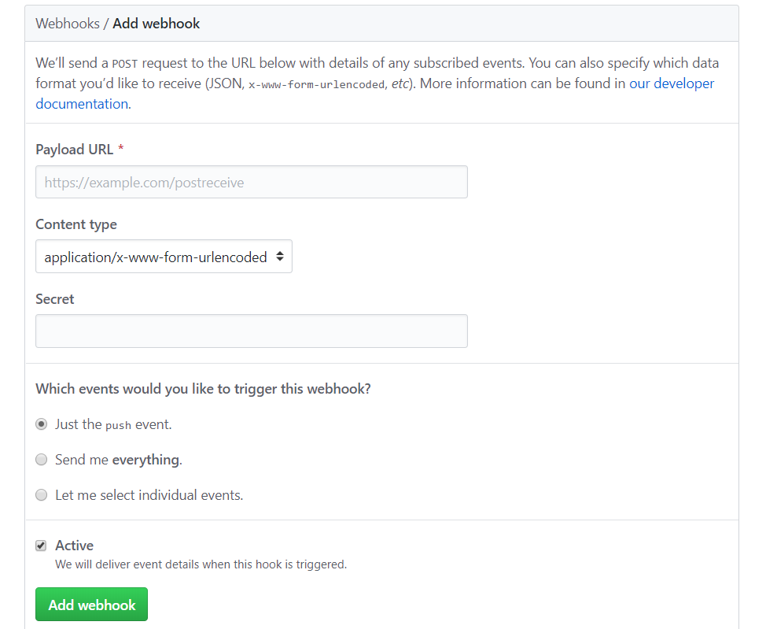
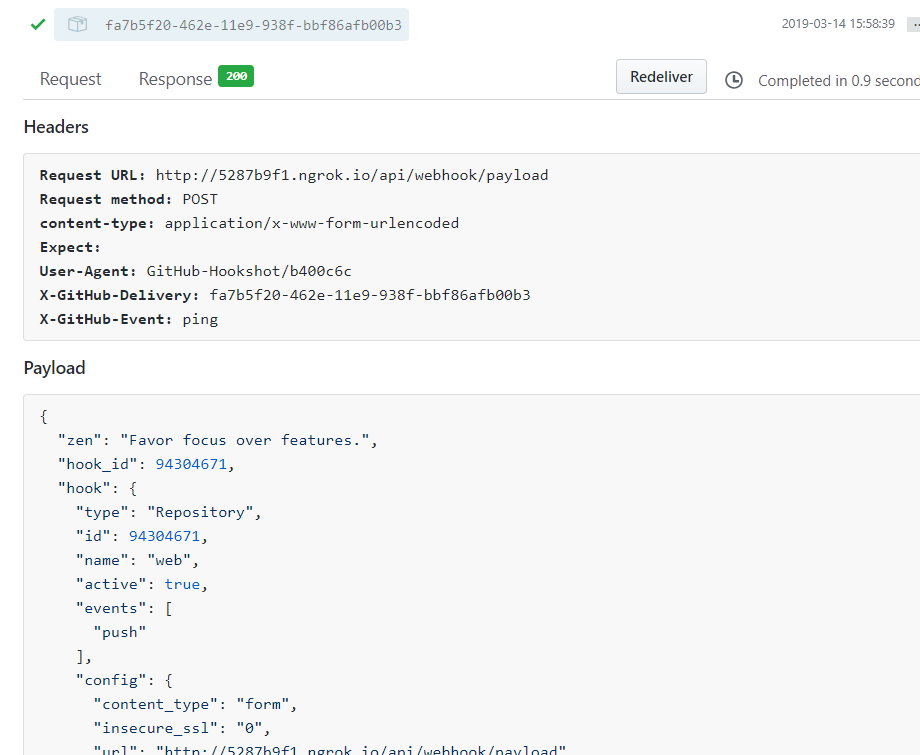
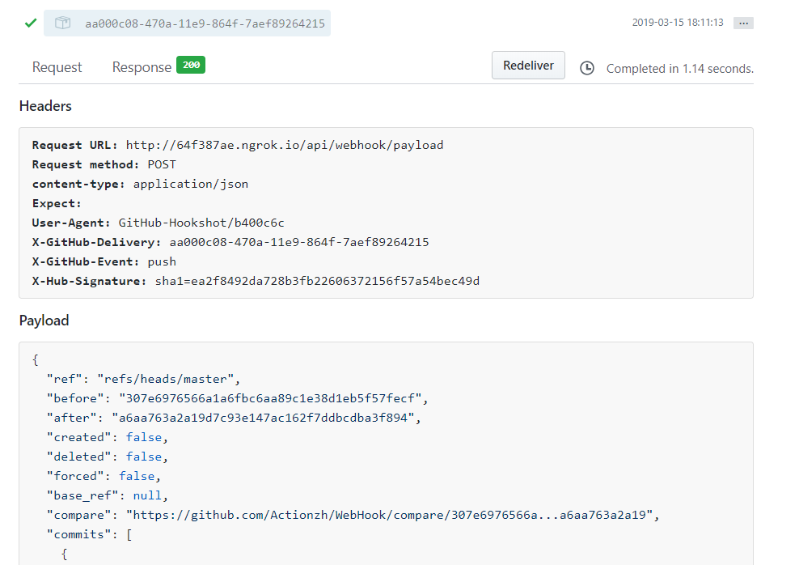
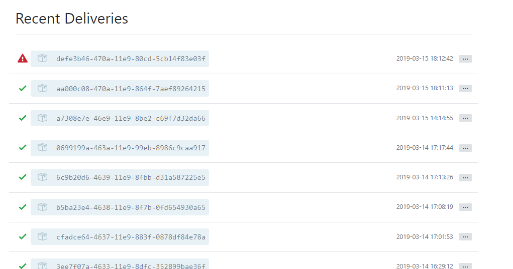
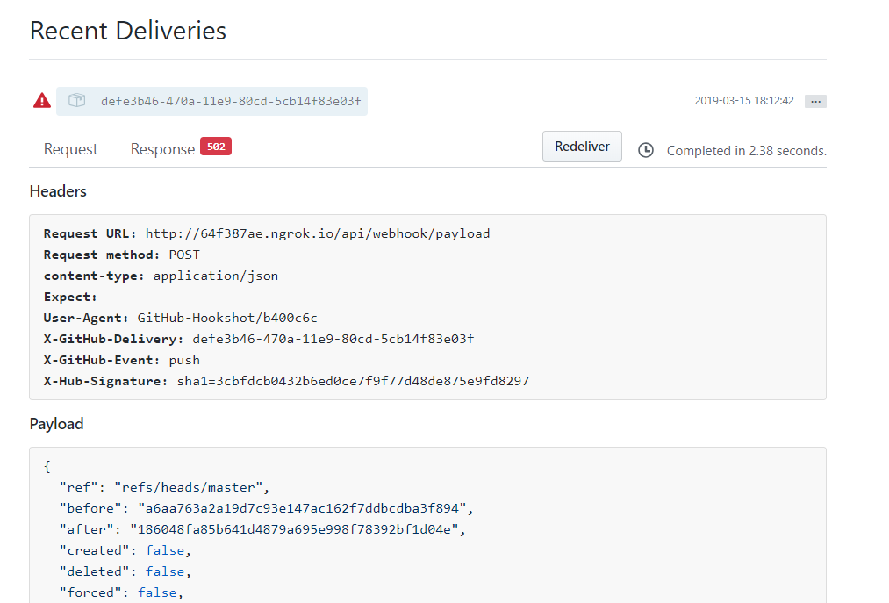

GitHub的webhooks设置包括 url设置 ,Content type设置(application/json或application/x-www-form-urlencoded请求内容方式), secret设置(可选,采用HMAC 方式加密) ,event设置(全选，或部分)，页面如下：

点击add webhook则设置成功，同时github会发出ping请求测试填写的url是否可用，请求如下：

之后当所设置的event发生时，github则会向设置的url发送请求，所有请求全部为post方式，并且记录请求发送内容和url返回的情况，页面如下：

无论hook请求是否成功，都会有列表记录，并且都有重发按钮进行请求重新发送，页面如下：

GitHub官网介绍：[webhooks](https://developer.github.com/webhooks/)