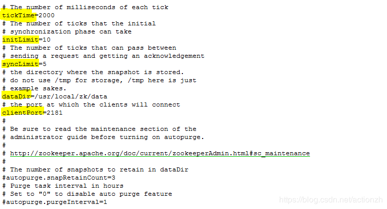

# 一、Zookeeper的搭建方式

Zookeeper安装方式有三种，**单机模式**和**集群模式**以及**伪集群模式**。

■ 单机模式：Zookeeper只运行在一台服务器上，适合测试环境；
■ 伪集群模式：就是在一台物理机上运行多个Zookeeper 实例；
■ 集群模式：Zookeeper运行于一个集群上，适合生产环境，这个计算机集群被称为一个“集合体”（ensemble）

Zookeeper通过复制来实现高可用性，只要集合体中半数以上的机器处于可用状态，它就能够保证服务继续。**为什么一定要超过半数呢**？这跟Zookeeper的复制策略有关：zookeeper确保对znode 树的每一个修改都会被复制到集合体中超过半数的机器上。

## 1.1 Zookeeper的单机模式搭建

**下载**ZooKeeper

**解压**：tar -zxvf zookeeper-3.4.5.tar.gz **重命名**：mv zookeeper-3.4.5 zk

**配置文件**：在conf目录下删除zoo_sample.cfg文件，创建一个配置文件zoo.cfg。

tickTime=2000
dataDir=/usr/local/zk/data
dataLogDir=/usr/local/zk/dataLog        
clientPort=2181

**配置环境变量**：为了今后操作方便，我们需要对Zookeeper的环境变量进行配置，方法如下在/etc/profile文件中加入如下内容：

export ZOOKEEPER_HOME=/usr/local/zk
export PATH=.:$HADOOP_HOME/bin:$ZOOKEEPER_HOME/bin:$JAVA_HOME/bin:$PATH

**启动**ZooKeeper的Server：zkServer.sh start；
**关闭**ZooKeeper的Server：zkServer.sh stop

## 1.2 Zookeeper的伪集群模式搭建

Zookeeper不但可以在单机上运行单机模式Zookeeper，而且可以在单机模拟集群模式 Zookeeper的运行，也就是将不同节点运行在同一台机器。我们知道伪分布模式下Hadoop的操作和分布式模式下有着很大的不同，但是在集群为分布 式模式下对Zookeeper的操作却和集群模式下没有本质的区别。显然，集群伪分布式模式为我们体验Zookeeper和做一些尝试性的实验提供了很大 的便利。比如，我们在实验的时候，可以先使用少量数据在集群伪分布模式下进行测试。当测试可行的时候，再将数据移植到集群模式进行真实的数据实验。这样不 但保证了它的可行性，同时大大提高了实验的效率。这种搭建方式，比较简便，成本比较低，适合测试和学习，如果你的手头机器不足，就可以在一台机器上部署了 3个server。

### **1.2.1\. 注意事项**

在一台机器上部署了3个server，需要注意的是在集群为分布式模式下我们使用的每个配置文档模拟一台机器，也就是说单台机器及上运行多个Zookeeper实例。但是，必须保证每个配置文档的各个端口号不能冲突，除了clientPort不同之外，dataDir也不同。另外，还要在dataDir所对应的目录中创建myid文件来指定对应的Zookeeper服务器实例。

■ clientPort端口：如果在1台机器上部署多个server，那么每台机器都要不同的 clientPort，比如 server1是2181,server2是2182，server3是2183

■ dataDir和dataLogDir：dataDir和dataLogDir也需要区分下，将数据文件和日志文件分开存放，同时每个server的这两变量所对应的路径都是不同的

■ server.X和myid： server.X 这个数字就是对应，data/myid中的数字。在3个server的myid文件中分别写入了0，1，2，那么每个server中的zoo.cfg都配 server.0 server.2,server.3就行了。因为在同一台机器上，后面连着的2个端口，3个server都不要一样，否则端口冲突

下面是我所配置的集群伪分布模式，分别通过zoo1.cfg、zoo2.cfg、zoo3.cfg来模拟由三台机器的Zookeeper集群,
代码清单 zoo1.cfg如下:

```
# The number of milliseconds of each tick
tickTime=2000

# The number of ticks that the initial
# synchronization phase can take
initLimit=10

# The number of ticks that can pass between
# sending a request and getting an acknowledgement
syncLimit=5

# the directory where the snapshot is stored.
dataDir=/usr/local/zk/data_1

# the port at which the clients will connect
clientPort=2181

#the location of the log file
dataLogDir=/usr/local/zk/logs_1

server.0=localhost:2287:3387
server.1=localhost:2288:3388
server.2=localhost:2289:3389
```

代码清单  zoo2.cfg如下:
```
# The number of milliseconds of each tick
tickTime=2000

# The number of ticks that the initial
# synchronization phase can take
initLimit=10

# The number of ticks that can pass between
# sending a request and getting an acknowledgement
syncLimit=5

# the directory where the snapshot is stored.
dataDir=/usr/local/zk/data_2

# the port at which the clients will connect
clientPort=2182

#the location of the log file
dataLogDir=/usr/local/zk/logs_2

server.0=localhost:2287:3387
server.1=localhost:2288:3388
server.2=localhost:2289:3389
```

代码清单 zoo3.cfg如下:
```
# The number of milliseconds of each tick
tickTime=2000

# The number of ticks that the initial
# synchronization phase can take
initLimit=10

# The number of ticks that can pass between
# sending a request and getting an acknowledgement
syncLimit=5

# the directory where the snapshot is stored.
dataDir=/usr/local/zk/data_3

# the port at which the clients will connect
clientPort=2183

#the location of the log file
dataLogDir=/usr/local/zk/logs_3

server.0=localhost:2287:3387
server.1=localhost:2288:3388
server.2=localhost:2289:3389
```

### 1.2.2 启动

在集群为分布式下，我们只有一台机器，按时要运行三个Zookeeper实例。此时，如果在使用单机模式的启动命令是行不通的。此时，只要通过下面三条命令就能运行前面所配置的Zookeeper服务。如下所示：

zkServer.sh start zoo1.sh
zkServer.sh start zoo2.sh
zkServer.sh start zoo3.sh

启动过程，如下图所示：


 启动结果，如下图所示：


在运行完第一条指令之后，会出现一些错误异常，产生异常信息的原因是由于Zookeeper 服务的每个实例都拥有全局配置信息，他们在启动的时候会随时随地的进行Leader选举操作。此时，第一个启动的Zookeeper需要和另外两个 Zookeeper实例进行通信。但是，另外两个Zookeeper实例还没有启动起来，因此就产生了这的异样信息。我们直接将其忽略即可，待把图中“2 号”和“3号”Zookeeper实例启动起来之后，相应的异常信息自然会消失。此时，可以通过下面三条命令，来查询。

 zkServer.sh status zoo1.cfg
 zkServer.sh status zoo2.cfg
 zkServer.sh status zoo3.cfg

Zookeeper服务的运行状态，如下图所示:
 


## 1.3  Zookeeper的集群模式搭建

为了获得可靠地Zookeeper服务，用户应该在一个机群上部署Zookeeper。只要机群上大多数的Zookeeper服务启动了，那么总的 Zookeeper服务将是可用的。集群的配置方式，和前两种类似，同样需要进行环境变量的配置。在每台机器上conf/zoo.cf配置文件的参数设置 相同

### 1.3.1 创建myid

在dataDir(/usr/local/zk/data)目录创建myid文件

Server0机器的内容为：0
Server1机器的内容为：1
Server2机器的内容为：2

### 1.3.2 编写配置文件

在conf目录下删除zoo_sample.cfg文件，创建一个配置文件zoo.cfg，如下所示,代码清单  zoo.cfg中的参数设置

```
# The number of milliseconds of each tick
tickTime=2000

# The number of ticks that the initial
# synchronization phase can take
initLimit=10

# The number of ticks that can pass between
# sending a request and getting an acknowledgement
syncLimit=5

# the directory where the snapshot is stored.
dataDir=/usr/local/zk/data

# the port at which the clients will connect
clientPort=2183

#the location of the log file
dataLogDir=/usr/local/zk/log

server.0=hadoop:2288:3388
server.1=hadoop0:2288:3388
server.2=hadoop1:2288:3388
```

### 1.3.3 启动

分别在3台机器上启动ZooKeeper的Server：zkServer.sh start；

# 二、Zookeeper的配置

Zookeeper的功能特性是通过Zookeeper配置文件来进行控制管理的(zoo.cfg).这样的设计其实有其自身的原因，通过前面对Zookeeper的配置可以看出，在对Zookeeper集群进行配置的时候，它的配置文档是完全相同的。集群伪分布模式中，有少部分是不同的。这样的配置方式使得在部署Zookeeper服务的时候非常方便。如果服务器使用不同的配置文件，必须确保不同配置文件中的服务器列表相匹配。

在设置Zookeeper配置文档时候，某些参数是可选的，某些是必须的。这些必须参数就构成了Zookeeper配置文档的最低配置要求。另外，若要对Zookeeper进行更详细的配置，可以参考下面的内容。

## 2.1 基本配置

下面是在最低配置要求中必须配置的参数：

**(1) client**：监听客户端连接的端口。
**(2) tickTime**：基本事件单元，这个时间是作为Zookeeper服务器之间或客户端与服务器之间维持心跳的时间间隔，每隔tickTime时间就会发送一个心跳；最小 的session过期时间为2倍tickTime 　　
**dataDir**：存储内存中数据库快照的位置，如果不设置参数，更新食物的日志将被存储到默认位置。

> 应该谨慎的选择日志存放的位置，使用专用的日志存储设备能够大大提高系统的性能，如果将日志存储在比较繁忙的存储设备上，那么将会很大程度上影像系统性能。

## 2.2 高级配置

下面是高级配置参数中可选配置参数，用户可以使用下面的参数来更好的规定Zookeeper的行为：

**(1) dataLogdDir**

这个操作让管理机器把事务日志写入“dataLogDir”所指定的目录中，而不是“dataDir”所指定的目录。这将允许使用一个专用的日志设备，帮助我们避免日志和快照的竞争。配置如下：

```
# the directory where the snapshot is stored
   dataDir=/usr/local/zk/data　
```
**(2)maxClientCnxns**

这个操作将限制连接到Zookeeper的客户端数量，并限制并发连接的数量，通过IP来区分不同的客户端。此配置选项可以阻止某些类别的Dos攻击。将他设置为零或忽略不进行设置将会取消对并发连接的限制。

例如，此时我们将maxClientCnxns的值设为1，如下所示：
```
# set maxClientCnxns
   maxClientCnxns=1
```
启动Zookeeper之后，首先用一个客户端连接到Zookeeper服务器上。之后如果有第二个客户端尝试对Zookeeper进行连接，或者有某些隐式的对客户端的连接操作，将会触发Zookeeper的上述配置。

**(3)minSessionTimeout和maxSessionTimeout**

即最小的会话超时和最大的会话超时时间。在默认情况下，minSession=2*tickTime；maxSession=20*tickTime。

## 2.3 集群配置

**(1) initLimit**

此配置表示，允许follower(相对于Leaderer言的“客户端”)连接并同步到Leader的初始化连接时间，以tickTime为单位。当初始化连接时间超过该值，则表示连接失败。

**(2) syncLimit**

此配置项表示Leader与Follower之间发送消息时，请求和应答时间长度。如果follower在设置时间内不能与leader通信，那么此follower将会被丢弃。

**(3) server.A=B：C：D**

A：其中 A 是一个数字，表示这个是服务器的编号；
B：是这个服务器的 ip 地址；
C：Leader选举的端口；
D：Zookeeper服务器之间的通信端口。

**(4) myid 和 zoo.cfg**

除了修改 zoo.cfg 配置文件，集群模式下还要配置一个文件 myid，这个文件在 dataDir 目录下，这个文件里面就有一个数据就是 A 的值，Zookeeper 启动时会读取这个文件，拿到里面的数据与 zoo.cfg 里面的配置信息比较从而判断到底是那个 server。

# 三、搭建ZooKeeper服务器集群

**搭建要求：**

(1) zk服务器集群规模不小于3个节点
(2) 要求各服务器之间系统时间要保持一致。

## 3.1 安装配置ZK

**(1)** 使用WinScp将Zk传输到Hadoop主机上的/usr/local，我用的版本是zookeeper-3.4.5.tar.gz。

**(2)** 在hadoop的/usr/local目录下，解压缩zk....tar.gz，设置环境变量

** 解压缩**: 在/usr/local目录下，执行命令：tar -zxvf zookeeper-3.4.5.tar.gz，如下图所示:


**重命名**：解压后将文件夹，重命名为zk，执行命令： mv zookeeper-3.4.5 zk，如下图所示:


**设置环境变量**：执行命令： vi /etc/profile ，添加 ：export ZOOKEEPER_HOME=/usr/local/zk，如图2.3所示的内容。执行命令：source /etc/profile 如下图所示:


## 3.2 修改ZK配置文件

**(1) 重命名**：将/usr/local/zk/conf目录下zoo_sample.cfg，重命名为zoo.cfg，执行命令：mv zoo_sample.cfg zoo.cfg。如如下图所示:


**(2) 查看**：在/usr/local/zk/conf目录下，修改文件 vi zoo.cfg，文件内容如下图所示。在该文件中dataDir表示文件存放目录，它的默认设置为/tmp/zookeeper这是一个临时存放目录，每 次重启后会丢失，在这我们自己设一个目录，/usr/local/zk/data。



**(3) 创建文件夹**：mkdir /usr/local/zk/data

**(4) 创建myid**：在data目录下，创建文件myid，值为0；vi myid ;内容为0。

**(5) 编辑**：编辑该文件，执行vi zoo.cfg ，修改dataDir=/usr/local/zk/data。

**新增**：

server.0=hadoop:2888:3888
server.1=hadoop0:2888:3888
server.2=hadoop1:2888:3888

> tickTime ：这个时间是作为 Zookeeper 服务器之间或客户端与服务器之间维持心跳的时间间隔，也就是每个 tickTime  时间就会发送一个心跳；
> 
> dataDir：顾名思义就是 Zookeeper 保存数据的目录，默认情况下，Zookeeper 将写数据的日志文件也保存在这个目录里；
> 
> clientPort：这个端口就是客户端连接 Zookeeper 服务器的端口，Zookeeper 会监听这个端口，接受客户端的访问请求。
> 
> 当这些配置项配置好后，就可以启动 Zookeeper 了，启动后使用命令echo ruok | nc localhost 2181检查 Zookeeper 是否已经在服务。

## 2.3 配置其他节点

**(1)** 把haooop主机的zk目录和/etc/profile目录，复制到hadoop0和hadoop1中。执行命令：
```
scp -r /usr/local/zk/ hadoop0:/usr/local/
scp -r /usr/local/zk/ hadoop1:/usr/local/
　　　　　　scp /etc/profile hadoop0:/etc/
　　　　　　scp /etc/profile hadoop1:/etc/

　　　　　　ssh hadoop0
　　　　　　suorce /etc/profile
　　　　　　vi /usr/local/zk/data/myid
　　　　　　exit

　　　　　　ssh hadoop1
　　　　　　suorce /etc/profile
　　　　　　vi /usr/local/zk/data/myid
　　　　　　exit
```

**(2)** 把hadoop1中相应的myid的值改为1，把hadoop2中相应的myid的值改为2。　　　

# 四、启动检验

**(1)** 启动，在三个节点上分别执行命令zkServer.sh start

**hadoop节点**：


**hadoop0节点**：


**hadoop1节点**：


**(2)** 检验，在三个节点上分别执行命令zkServer.sh status，从下面的图中我们会发现hadoop和hadoop1为Follower，hadoop0为Leader。

**hadoop节点**：


**hadoop0节点**：


**hadoop1节点**：


