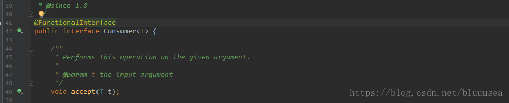
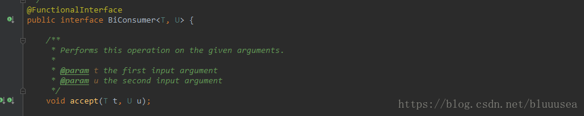

java中的集合有两种形式Collection<E>，Map<K,V>

Collection类型集合 
在JAVA7中遍历有一下几种方式：

```java
List<String> list = Arrays.asList("aaaa","bbbb");
//for循环
for (int i=0;i< list.size();i++){
    System.out.println(list.get(i));
}

//增强for循环
for(String str : list){
    System.out.println(str);
}
//迭代器
Iterator<String> iterator = list.iterator();
while (iterator.hasNext()){
    System.out.println(iterator.next());
}
```


在JAVA8中还可以使用forEach来遍历：

```
list.forEach(new Consumer<String>() {
    @Override
    public void accept(String s) {
        System.out.println(s);
    }
});
```

发现和使用sort排序的写法是一样的：

```
Collections.sort(list, new Comparator<String>() {
    @Override
    public int compare(String o1, String o2) {
        return o1.compareTo(o2);
    }
});
```

发现代码量没有减少多少，那么我们在加上Lambda表达式，如下：

```
list.forEach(str-> System.out.println(str));
```

sort排序也使用Lambda表达式，如下：

```
Collections.sort(list,(o1,o2)->{return  o1.compareTo(o2);});
```

Map类型集合 
在JAVA7中遍历有下面几种方式：
```
Map<String,String> map = new HashMap<>();
map.put("id","11");
map.put("name","zhangsan");
map.put("age","30");
for (Map.Entry<String,String> entry : map.entrySet()){
    System.out.println("k=" + entry.getKey() + ",v=" + entry.getValue());
}
for (String key : map.keySet()){
    System.out.println("k=" + key + ",v=" + map.get(key));
}
Iterator<Map.Entry<String, String>> iterator = map.entrySet().iterator();
while (iterator.hasNext()){
    Map.Entry<String, String> entry = iterator.next();
    System.out.println("k=" + entry.getKey() + ",v=" + entry.getValue());
}
for (String v : map.values()){
    System.out.println("v=" + v);
}
```

使用JAVA8的forEach遍历，如下：

```
map.forEach(new BiConsumer<String, String>() {
    @Override
    public void accept(String s, String s2) {
        System.out.println("k=" + s + ",v=" + s2);
    }
});
```

也可以使用Lambda表达式，如下：

```
map.forEach((k,v)-> System.out.println("v="+k+",v="+v));
```

本文中只使用forEach，没有使用JAVA8的Stream包。 
注：例子中出现的Consumer和BiConsumer是JAVA8中新增的函数式接口，Consumer接口中只有一个无返回结果并且只有一个泛型参数的方法，源码如下：


BiConsumer接口中提供的是一个无返回结果并且有两个泛型参数的方法，源码如下： 


