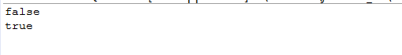

### List接口中定义：

```
List<E> subList(int fromIndex, int toIndex);
```

### 英文注释：

```
Returns a view of the portion of this list between the specified fromIndex, inclusive, and toIndex, exclusive. (If fromIndex and toIndex are equal, the 
returned list is empty.) The returned list is backed by this list, so non-structural changes in the returned list are reflected in this list, and vice-versa. 
The returned list supports all of the optional list operations supported by this list.

This method eliminates the need for explicit range operations (of the sort that commonly exist for arrays). Any operation that expects a list can be used as a 
range operation by passing a subList view instead of a whole list. For example, the following idiom removes a range of elements from a list: 
      list.subList(from, to).clear();

Similar idioms may be constructed for indexOf and lastIndexOf, and all of the algorithms in the Collections class can be applied to a subList.
The semantics of the list returned by this method become undefined if the backing list (i.e., this list) is structurally modified in any way other than via 
the returned list. (Structural modifications are those that change the size of this list, or otherwise perturb it in such a fashion that iterations in 
progress may yield incorrect results.)
```

根据注释得知：

1，该方法返回的是父list的一个视图，从fromIndex（包含），到toIndex（不包含）。fromIndex=toIndex 表示子list为空

2，父子list做的非结构性修改（non-structural changes）都会影响到彼此：所谓的“非结构性修改”，是指不涉及到list的大小改变的修改。相反，结构性修改，指改变了list大小的修改。

3，对于结构性修改，子list的所有操作都会反映到父list上。但父list的修改将会导致返回的子list失效。

4，tips：如何删除list中的某段数据：

list.subList(from, to).clear();

### 示例代码：

来自[【Java每日一题】20170105](http://www.cnblogs.com/weknow619/p/6251065.html)，就是看到这个题目才让我知道list的这个方法我没有接触过

```
package ques; import java.util.ArrayList; import java.util.List; public class Ques0105 { public static void main(String[] args) {  
        List<String> list = new ArrayList<String>();  
        list.add("a"); // 使用构造器创建一个包含list的列表list1 
        List<String> list1 = new ArrayList<String>(list); // 使用subList生成与list相同的列表list2 
        List<String> list2 = list.subList(0, list.size());  
        list2.add("b");  

        System.out.println(list.equals(list1));  
        System.out.println(list.equals(list2));  
    }  
}
```

返回结果如下：


可以发现，list2为list的子list，当list2发生结构性修改（list2.add("b")）后，list也发生相应改变，所以返回结果为false和true
