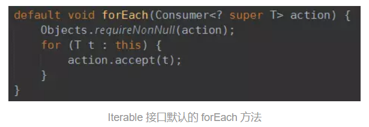
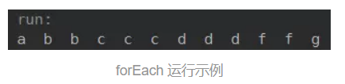
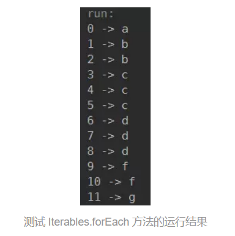
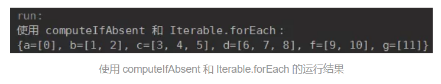

# Java8：当 forEach 需要索引

在 [上一篇文章](https://www.jianshu.com/p/5db0cf79d2d5) 中，我们讨论了如何使用 Java8 中 `Map` 添加的新方法 `computeIfAbsent` 来统计集合中每个元素出现的所有位置，代码如下：

```
public static Map<String, List<Integer>> getElementPositions(List<String> list) {
    Map<String, List<Integer>> positionsMap = new HashMap<>();

    for (int i = 0; i < list.size(); i++) {
        positionsMap.computeIfAbsent(list.get(i), k -> new ArrayList<>(1)).add(i);
    }

    return positionsMap;
}

```

至少有两点需要探讨：
1、如果 _list_ 不是基于数组的（即不是 `RandomAccess` 的），而是基于链表的，那么 `list.get(int index)` 方法的效率就值得思考了；
2、既然都有了 Lambda（即当前平台为 Java8），我们为什么还要一次次去写传统的 for 循环呢？

在 Java8 中，为 `Iterable` 接口添加了默认的 `forEach` 方法：



很好理解，遍历当前 `Iterable` 中所有的元素，使用每个元素作为参数调用一次 _action_。而 `Collection` 接口继承了 `Iterable` 接口，所以所有的继承自 `Collection` 的集合类都可以直接调用 `forEach` 方法。比如：

```
public static void main(String[] args) throws Exception {
    List<String> list = Arrays.asList("a", "b", "b", "c", "c", "c", "d", "d", "d", "f", "f", "g");

    list.forEach(str -> System.out.print(str + "  "));

    System.out.println();
}

```

运行结果：


forEach 运行示例

那如果我们在遍历的时候需要使用到元素的索引呢（类似 `getElementPositions` 方法那样）？
很可惜，Java8 的 `Iterable` 并没有提供一个带索引的 `forEach` 方法。不过自己动手，丰衣足食 —— 让我们自己写一个带索引的 `forEach` 方法：

```
import java.util.Objects;
import java.util.function.BiConsumer;

/**
 * Iterable 的工具类
 */
public class Iterables {

    public static <E> void forEach(
            Iterable<? extends E> elements, BiConsumer<Integer, ? super E> action) {
        Objects.requireNonNull(elements);
        Objects.requireNonNull(action);

        int index = 0;
        for (E element : elements) {
            action.accept(index++, element);
        }
    }
}

```

该 `forEach` 方法第一个参数为要遍历的 `Iterable`，第二个参数为 `BiConsumer`。`BiConsumer` 的输入参数第一个即索引，第二个为元素。

我们测试下这个 `forEach` 方法：

```
public static void main(String[] args) throws Exception {

    List<String> list = Arrays.asList("a", "b", "b", "c", "c", "c", "d", "d", "d", "f", "f", "g");

    Iterables.forEach(list, (index, str) -> System.out.println(index + " -> " + str));
}

```

运行结果：


结果和预期的一致。

现在我们使用 `Iterables.forEach` 改写 `getElementPositions` 方法：

```
public static Map<String, List<Integer>> getElementPositions(List<String> list) {
    Map<String, List<Integer>> positionsMap = new HashMap<>();

    Iterables.forEach(list, (index, str) -> {
        positionsMap.computeIfAbsent(str, k -> new ArrayList<>(1)).add(index);
    });

    return positionsMap;
}

public static void main(String[] args) throws Exception {
    List<String> list = Arrays.asList("a", "b", "b", "c", "c", "c", "d", "d", "d", "f", "f", "g");

    System.out.println("使用 computeIfAbsent 和 Iterable.forEach：");
    Map<String, List<Integer>> elementPositions = getElementPositions(list);
    System.out.println(elementPositions);
}

```

运行结果和原来一致：


使用 computeIfAbsent 和 Iterable.forEach 的运行结果

真的不明白这么简单且实用的方法，Java8 为什么不在 `Iterable` 中提供一个默认实现（此处应有黑人问号）。

