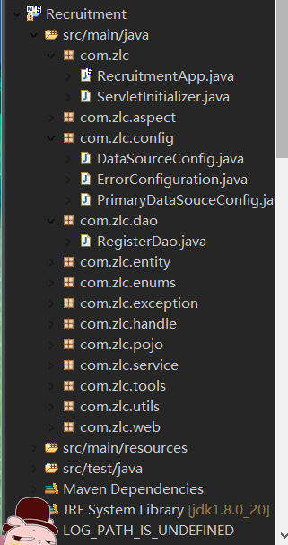
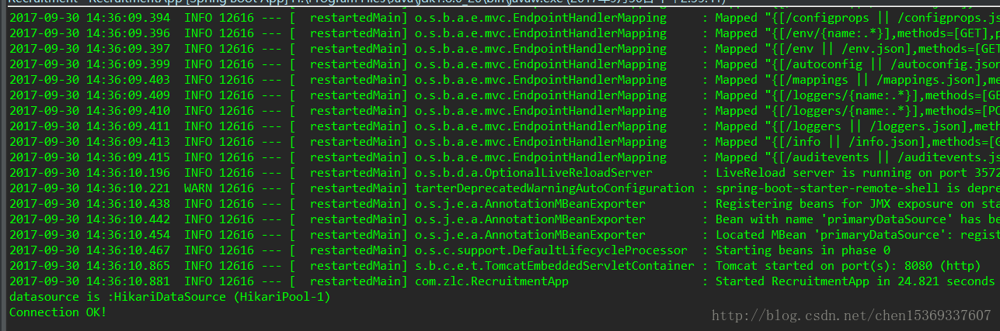
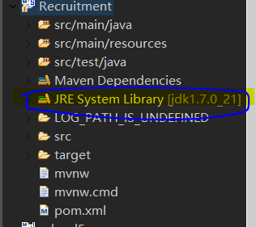
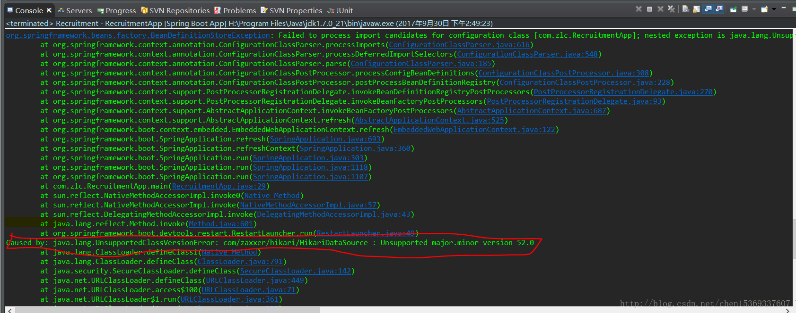

本篇文章主要实现SpringBoot中使用hikariCP； 
一 、使用工具 
1. JDK1.8 
2. springToolSuit(STS) 
3. maven 
二、创建项目 
1.首先创建一个SpringBoot项目，勾选web，mysql等具体怎样创建可以参考我的上两个博客；传送门 
2.maven 依赖如下： 
1）Java 8 maven artifact:

```
<dependency>
    <groupId>com.zaxxer</groupId>
    <artifactId>HikariCP</artifactId>
    <version>2.6.1</version>
    <scope>compile</scope>
</dependency>
```

2）Java 7 maven artifact:

```
<dependency>
        <groupId>com.zaxxer</groupId>
        <artifactId>HikariCP-java7</artifactId>
        <version>2.4.11</version>
        <scope>compile</scope>
    </dependency>
```

我的maven依赖为：

```
<dependencies>
        <!-- spring aop -->
        <dependency>
            <groupId>org.springframework.boot</groupId>
            <artifactId>spring-boot-starter-aop</artifactId>
        </dependency>
        <!-- spring data jpa -->
        <dependency>
            <groupId>org.springframework.boot</groupId>
            <artifactId>spring-boot-starter-data-jpa</artifactId>
        </dependency>
        <!-- hibernate 依赖 -->
        <dependency>
            <groupId>org.hibernate.javax.persistence</groupId>
            <artifactId>hibernate-jpa-2.1-api</artifactId>
            <version>1.0.0.Final</version>
        </dependency>
        <!-- JDBC连接数据库，因为要用HikariCP，所以需要将SpringBoot中的tomcat-jdbc排除 -->
        <dependency>
            <groupId>org.springframework.boot</groupId>
            <artifactId>spring-boot-starter-jdbc</artifactId>
            <exclusions>
                <exclusion>
                    <groupId>org.apache.tomcat</groupId>
                    <artifactId>tomcat-jdbc</artifactId>
                </exclusion>
            </exclusions>
        </dependency>
        <!-- HikariCP 连接池依赖，从父依赖获取额版本 -->
        <dependency>
            <groupId>com.zaxxer</groupId>
            <artifactId>HikariCP</artifactId>
            <!-- <scope>runtime</scope> -->
        </dependency> 

        <!-- 因为配置了thymeleaf 模板，可以将此注释
        <dependency>
            <groupId>org.springframework.boot</groupId>
            <artifactId>spring-boot-starter-web</artifactId>
        </dependency> -->
        <!-- thymeleaf 模板   默认包含spring-boot-starter-web-->
        <dependency>
            <groupId>org.springframework.boot</groupId>
            <artifactId>spring-boot-starter-thymeleaf</artifactId>
        </dependency>

        <!-- 连接mysql数据库驱动 -->
        <dependency>
            <groupId>mysql</groupId>
            <artifactId>mysql-connector-java</artifactId>
            <scope>runtime</scope>
        </dependency>
        <!-- spring boot 内置tomcat -->
        <dependency>
            <groupId>org.springframework.boot</groupId>
            <artifactId>spring-boot-starter-tomcat</artifactId>
            <scope>provided</scope>
        </dependency>

        <!--@ConfigurationProperties注解-->
        <dependency>
            <groupId>org.springframework.boot</groupId>
            <artifactId>spring-boot-configuration-processor</artifactId>
            <optional>true</optional>
        </dependency>

        <!-- net json 这个必须配置jdk的版本号 -->
        <dependency>
            <groupId>net.sf.json-lib</groupId>
            <artifactId>json-lib</artifactId>
            <version>2.4</version>
            <classifier>jdk15</classifier>
        </dependency>
        <!-- https://mvnrepository.com/artifact/com.thoughtworks.xstream/xstream -->

        <!-- LEGACYHTML5需要搭配一个额外的库NekoHTML才可用,解决严格的html验证问题 -->
        <dependency>  
            <groupId>net.sourceforge.nekohtml</groupId>  
            <artifactId>nekohtml</artifactId>  
        </dependency>

        <!-- 单元测试相关依赖 -->
        <dependency>
            <groupId>org.springframework.boot</groupId>
            <artifactId>spring-boot-starter-test</artifactId>
            <scope>test</scope>
        </dependency>
    </dependencies>
```

SpringBoot父依赖如下：
```
<parent>
        <groupId>org.springframework.boot</groupId>
        <artifactId>spring-boot-starter-parent</artifactId>
        <version>1.5.6.RELEASE</version>
        <relativePath/> <!-- lookup parent from repository -->
    </parent>
```

这里需要注意的是，因为用了最新的SpringBoot版本，HikarICP从SpringBoot继承版本，所以JDK需要配置为1.8，如果不是将会出现错误，错误原因将会在下面展示。 

3.数据库连接配置文件如下(我将数据库连接配置单独写在了一个配置文件，这样找起来比较清晰，文件名为 datasource.properties ，后面的配置类中要用到此名字)：
```
#第一个数据源（多数据源将会在后面介绍,primary表示为第一个数据源）
spring.datasource.primary.dataSourceClassName=com.mysql.jdbc.jdbc2.optional.MysqlDataSource
spring.datasource.primary.dataSourceProperties.serverName=localhost
spring.datasource.primary.dataSourceProperties.portNumber=3306
spring.datasource.primary.dataSourceProperties.databaseName=newrecruit
spring.datasource.primary.username=root
spring.datasource.primary.password=yourpassword
# 下面为连接池的补充设置，应用到上面所有数据源中
#自动提交
spring.datasource.default-auto-commit=true
#指定updates是否自动提交
spring.datasource.auto-commit=true
spring.jpa.show-sql = true
spring.datasource.maximum-pool-size=100
spring.datasource.max-idle=10
spring.datasource.max-wait=10000
spring.datasource.min-idle=5
spring.datasource.initial-size=5
spring.datasource.validation-query=SELECT 1
spring.datasource.test-on-borrow=false
spring.datasource.test-while-idle=true
# 配置间隔多久才进行一次检测，检测需要关闭的空闲连接，单位是毫秒 
spring.datasource.time-between-eviction-runs-millis=18800
# 配置一个连接在池中最小生存的时间，单位是毫秒 
spring.datasource.minEvictableIdleTimeMillis=300000

# Hibernate ddl auto (create, create-drop, update)
spring.jpa.hibernate.ddl-auto=update  
#spring.jpa.database-platform=org.hibernate.dialect.MySQL5Dialect  
spring.jpa.hibernate.naming_strategy=org.hibernate.cfg.ImprovedNamingStrategy  
#spring.jpa.database=org.hibernate.dialect.MySQL5InnoDBDialect 
spring.jpa.properties.hibernate.dialect=org.hibernate.dialect.MySQL5Dialect
```

数据库配置文件写好以后，开始写配置类 :
```
package com.zlc.config;

import javax.sql.DataSource;

import org.slf4j.Logger;
import org.slf4j.LoggerFactory;
import org.springframework.beans.factory.annotation.Qualifier;
import org.springframework.boot.autoconfigure.jdbc.DataSourceBuilder;
import org.springframework.boot.context.properties.ConfigurationProperties;
import org.springframework.context.annotation.Bean;
import org.springframework.context.annotation.Configuration;
import org.springframework.context.annotation.Primary;
import org.springframework.context.annotation.PropertySource;


/**
  * <p>Company: </p> 
  * @Description: 
  * @Create Date: 2017年8月13日下午11:59:49
  * @Version: V1.00 
  * @Author: 追到乌云的尽头找太阳
  */
@Configuration
@PropertySource("classpath:datasource.properties")
public class DataSourceConfig {

    private Logger logger = LoggerFactory.getLogger(DataSourceConfig.class);


    @Bean(name = "primaryDataSource")
    @Primary
    @Qualifier("primaryDataSource")
    @ConfigurationProperties(prefix="spring.datasource.primary" )
    public DataSource primaryDataSource() {
        logger.info("数据库连接池创建中.......");
        return DataSourceBuilder.create().build();
    }

}
```

一个@PropertySource(“classpath:datasource.properties”)注解，就可以免去我们自己写读取配置文件的麻烦 
第一个数据源的配置类如下：
```
package com.zlc.config;

import org.springframework.beans.factory.annotation.Autowired;
import org.springframework.beans.factory.annotation.Qualifier;
import org.springframework.boot.autoconfigure.orm.jpa.JpaProperties;
import org.springframework.boot.orm.jpa.EntityManagerFactoryBuilder;
import org.springframework.context.annotation.Bean;
import org.springframework.context.annotation.Configuration;
import org.springframework.context.annotation.Primary;
import org.springframework.data.jpa.repository.config.EnableJpaRepositories;
import org.springframework.orm.jpa.JpaTransactionManager;
import org.springframework.orm.jpa.LocalContainerEntityManagerFactoryBean;
import org.springframework.transaction.PlatformTransactionManager;
import org.springframework.transaction.annotation.EnableTransactionManagement;

import javax.persistence.EntityManager;
import javax.sql.DataSource;

import java.util.Map;

/**
  * <p>Company: 信息技术研究所 </p> 
  * @Description: 第一个数据源的配置类
  * @Create Date: 2017年5月11日下午9:22:12
  * @Version: V1.00 
  * @Author: 追到乌云的尽头找太阳
  */
@Configuration
@EnableTransactionManagement
@EnableJpaRepositories(
        entityManagerFactoryRef="entityManagerFactoryPrimary",
        transactionManagerRef="transactionManagerPrimary",
        basePackages= { "com.zlc.dao" }) //设置Repository所在位置
public class PrimaryDataSouceConfig {

    @Autowired @Qualifier("primaryDataSource")
    private DataSource primaryDataSource;

    @Primary
    @Bean(name = "entityManagerPrimary")
    public EntityManager entityManager(EntityManagerFactoryBuilder builder) {
        return entityManagerFactoryPrimary(builder).getObject().createEntityManager();
    }

    @Primary
    @Bean(name = "entityManagerFactoryPrimary")
    public LocalContainerEntityManagerFactoryBean entityManagerFactoryPrimary (EntityManagerFactoryBuilder builder) {
        return builder
                .dataSource(primaryDataSource)
                .properties(getVendorProperties(primaryDataSource))
                .packages("com.zlc.entity") //设置实体类所在位置
                .persistenceUnit("primaryPersistenceUnit")
                .build();
    }

    @Autowired
    private JpaProperties jpaProperties;

    private Map<String, String> getVendorProperties(DataSource dataSource) {
        return jpaProperties.getHibernateProperties(dataSource);
    }

    @Primary
    @Bean(name = "transactionManagerPrimary")
    public PlatformTransactionManager transactionManagerPrimary(EntityManagerFactoryBuilder builder) {
        return new JpaTransactionManager(entityManagerFactoryPrimary(builder).getObject());
    }

```


上面有连个需要注意的地方，一个是JPA所在的包名： basePackages= { “com.b505.dao” }) //设置Repository所在位置，一定不能写错，一个JPA实体类所在的位置： .packages(“com.b505.entity”) //设置实体类所在位置。

我们在main方法中我们可以检查一下（一定要注意SpringBoot项目的结构，因为SpringBoot是自动扫描并注册类注册到Spring的上下文中所以main所在的类的包名一定是最大的，这样用其他注解的类才能正常注册，我的项目结构如下）： 


如果你的controller写在了com.zlca.web；那么项目编译不会产生错误，但是此web层的映射全都不能用，因为没有注册到Spring中。SpringBoot是扫描@SpringBootApplication下的类以及此注解的子文件夹下的类； 
main方法如下：
```
package com.zlc;

import java.sql.Connection;
import java.sql.ResultSet;
import java.sql.SQLException;

import javax.sql.DataSource;

import org.springframework.boot.SpringApplication;
import org.springframework.boot.autoconfigure.SpringBootApplication;
import org.springframework.context.ApplicationContext;

import com.zaxxer.hikari.HikariDataSource;

/**
 * <p>Company: 信息技术研究所 </p> 
 * @Description: 程序的入口
 * @Create Date: 2017年9月14日下午1:11:05
 * @Version: V1.00 
 * @Author: 追到乌云的尽头找太阳
 */
@SpringBootApplication
public class RecruitmentApp {

    public static void main(String[] args) {
        ApplicationContext applicationContext = SpringApplication.run(
                RecruitmentApp.class, args);
        DataSource dataSource = applicationContext.getBean(DataSource.class);
        System.out.println("datasource is :" + dataSource);
        //检查数据库是否是hikar数据库连接池
        if (!(dataSource instanceof HikariDataSource)) {
            System.err.println(" Wrong datasource type :"
                    + dataSource.getClass().getCanonicalName());
            System.exit(-1);
        }
        try {
            Connection connection = dataSource.getConnection();
            ResultSet rs = connection.createStatement()
                    .executeQuery("SELECT 1");
            if (rs.first()) {

                System.out.println("Connection OK!");
            } else {
                System.out.println("Something is wrong");
            }
            // connection.close();
            // System.exit(0);

        } catch (SQLException e) {
            System.out.println("FAILED");
            e.printStackTrace();
            System.exit(-2);
            // TODO: handle exception
        }

    }

}
```

HIkariCP已经配置好了，启动main； 


完工；这里需要注意的一点，如果是用jdk1.7，则会出现如下错误： 



这个就是本博客一开始中说的jdk版本和Hikari的版本要对应上。此错误只需要将JDK换成1.8即可。

参考：
https://blog.csdn.net/chen15369337607/article/details/78142751
https://blog.csdn.net/clementad/article/details/46928621
