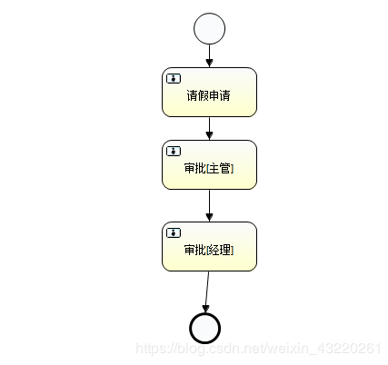
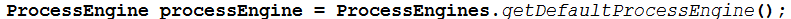
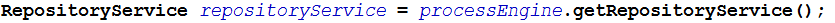
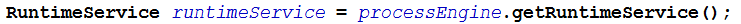
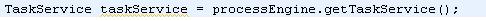
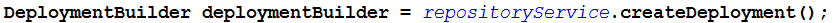
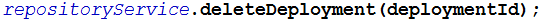
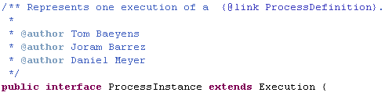
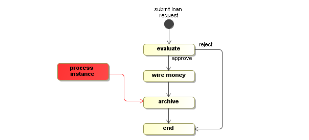
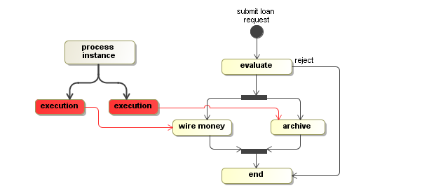

## 1、工作流引擎：
ProcessEngine对象，它是Activiti的核心类，由该类可以获取其他服务实例（历史服务、创库服务、任务服务、用户参与者服务）；

## 2、BPMN：
业务流程建模与标注（Business Process Model and Notation，BPMN) ，描述流程的基本符号，包括这些图元如何组合成一个业务流程图（Business Process Diagram）；

## 3、数据库（先学后看）
Activiti的后台是有数据库来支持的，所有的表都是由ACT开头的。第二部分是表示表的用途的两个字母标识。
用途也和服务的API对应。Activiti工作流的数据库有23张表。

ACT_RE_*: 'RE’表示repository。 这个前缀的表包含了流程定义和流程静态资源 （图片，规则，等等）。

ACT_RU_*: 'RU’表示runtime。 这些运行时的表，包含流程实例，任务，变量，异步任务，等运行中的数据。 Activiti只在流程实例执行过程中保存这些数据， 在流程结束时就会删除这些记录。 这样运行时表可以一直很小速度很快。

ACT_ID_*: 'ID’表示identity。 这些表包含身份信息，比如用户，组等等。

ACT_HI_*: 'HI’表示history。 这些表包含历史数据，比如历史流程实例， 变量，任务等等。

ACT_GE_*: 通用数据， 用于不同场景下，如存放资源文件。

```
3.3.1：资源库流程规则表
1)	act_re_deployment 	部署信息表
2)	act_re_model  		流程设计模型部署表
3)	act_re_procdef  		流程定义数据表
3.3.2：运行时数据库表
1)	act_ru_execution		运行时流程执行实例表
2)	act_ru_identitylink		运行时流程人员表，主要存储任务节点与参与者的相关信息
3)	act_ru_task			运行时任务节点表
4)	act_ru_variable		运行时流程变量数据表
3.3.3：历史数据库表
1)	act_hi_actinst 		历史节点表
2)	act_hi_attachment		历史附件表
3)	act_hi_comment		历史意见表
4)	act_hi_identitylink		历史流程人员表
5)	act_hi_detail			历史详情表，提供历史变量的查询
6)	act_hi_procinst		历史流程实例表
7)	act_hi_taskinst		历史任务实例表
8)	act_hi_varinst			历史变量表
3.3.4：组织机构表
1)	act_id_group		用户组信息表
2)	act_id_info			用户扩展信息表
3)	act_id_membership	用户与用户组对应信息表
4)	act_id_user			用户信息表
这四张表很常见，基本的组织机构管理，关于用户认证方面建议还是自己开发一套，组件自带的功能太简单，使用中有很多需求难以满足 
3.3.5：通用数据表
1)	act_ge_bytearray		二进制数据表
2)	act_ge_property			属性数据表存储整个流程引擎级别的数据,初始化表结构时，会默认插入三条记录，
```

## 4、Activiti项目
### 1、LeaveBill.png


### 2、LeaveBill.bpmn
LeaveBill.bpmn是上面LeaveBill.png工作流的配置文件
    Start event：开始事件 
    End entit：结束事件 
    User task：用户任务活动 
    Service task：服务任务活动 
    Exclusive gateway：独家网关，排它网关通道，只能有一条分支执行，如if else 
    Parallel gateway：并行网关，并行网关通道，所有分支一块执行
```
<?xml version="1.0" encoding="UTF-8"?>
<definitions xmlns="http://www.omg.org/spec/BPMN/20100524/MODEL" xmlns:xsi="http://www.w3.org/2001/XMLSchema-instance" xmlns:xsd="http://www.w3.org/2001/XMLSchema" xmlns:activiti="http://activiti.org/bpmn" xmlns:bpmndi="http://www.omg.org/spec/BPMN/20100524/DI" xmlns:omgdc="http://www.omg.org/spec/DD/20100524/DC" xmlns:omgdi="http://www.omg.org/spec/DD/20100524/DI" typeLanguage="http://www.w3.org/2001/XMLSchema" expressionLanguage="http://www.w3.org/1999/XPath" targetNamespace="http://www.activiti.org/test">
  <process id="leaveBill" name="leaveProcess" isExecutable="true">
    <startEvent id="startevent1" name="Start"></startEvent>
      <!--开启了三个工作流-->
    <userTask id="usertask1" name="请假申请" activiti:assignee="张三"></userTask>
    <userTask id="usertask2" name="审批[主管]" activiti:assignee="李四"></userTask>
    <userTask id="usertask3" name="审批[经理]" activiti:assignee="王五"></userTask>
    <endEvent id="endevent1" name="End"></endEvent>
    <sequenceFlow id="flow1" sourceRef="startevent1" targetRef="usertask1"></sequenceFlow>
    <sequenceFlow id="flow2" sourceRef="usertask1" targetRef="usertask2"></sequenceFlow>
    <sequenceFlow id="flow3" sourceRef="usertask2" targetRef="usertask3"></sequenceFlow>
    <sequenceFlow id="leaveBill" sourceRef="usertask3" targetRef="endevent1"></sequenceFlow>
  </process>
  <bpmndi:BPMNDiagram id="BPMNDiagram_leaveBill">
    <bpmndi:BPMNPlane bpmnElement="leaveBill" id="BPMNPlane_leaveBill">
      <bpmndi:BPMNShape bpmnElement="startevent1" id="BPMNShape_startevent1">
        <omgdc:Bounds height="35.0" width="35.0" x="295.0" y="20.0"></omgdc:Bounds>
      </bpmndi:BPMNShape>
      <bpmndi:BPMNShape bpmnElement="usertask1" id="BPMNShape_usertask1">
        <omgdc:Bounds height="55.0" width="105.0" x="260.0" y="80.0"></omgdc:Bounds>
      </bpmndi:BPMNShape>
      <bpmndi:BPMNShape bpmnElement="usertask2" id="BPMNShape_usertask2">
        <omgdc:Bounds height="55.0" width="105.0" x="260.0" y="160.0"></omgdc:Bounds>
      </bpmndi:BPMNShape>
      <bpmndi:BPMNShape bpmnElement="usertask3" id="BPMNShape_usertask3">
        <omgdc:Bounds height="55.0" width="105.0" x="260.0" y="250.0"></omgdc:Bounds>
      </bpmndi:BPMNShape>
      <bpmndi:BPMNShape bpmnElement="endevent1" id="BPMNShape_endevent1">
        <omgdc:Bounds height="35.0" width="35.0" x="290.0" y="350.0"></omgdc:Bounds>
      </bpmndi:BPMNShape>
      <bpmndi:BPMNEdge bpmnElement="flow1" id="BPMNEdge_flow1">
        <omgdi:waypoint x="312.0" y="55.0"></omgdi:waypoint>
        <omgdi:waypoint x="312.0" y="80.0"></omgdi:waypoint>
      </bpmndi:BPMNEdge>
      <bpmndi:BPMNEdge bpmnElement="flow2" id="BPMNEdge_flow2">
        <omgdi:waypoint x="312.0" y="135.0"></omgdi:waypoint>
        <omgdi:waypoint x="312.0" y="160.0"></omgdi:waypoint>
      </bpmndi:BPMNEdge>
      <bpmndi:BPMNEdge bpmnElement="flow3" id="BPMNEdge_flow3">
        <omgdi:waypoint x="312.0" y="215.0"></omgdi:waypoint>
        <omgdi:waypoint x="312.0" y="250.0"></omgdi:waypoint>
      </bpmndi:BPMNEdge>
      <bpmndi:BPMNEdge bpmnElement="leaveBill" id="BPMNEdge_leaveBill">
        <omgdi:waypoint x="312.0" y="305.0"></omgdi:waypoint>
        <omgdi:waypoint x="307.0" y="350.0"></omgdi:waypoint>
      </bpmndi:BPMNEdge>
    </bpmndi:BPMNPlane>
  </bpmndi:BPMNDiagram>
</definitions>

```

## 5 核心API
### 5.1：ProcessEngine
说明：
1) 在Activiti中最核心的类，其他的类都是由他而来。
2) 产生方式：


在前面看到了两种创建ProcessEngine（流程引擎）的方式，而这里要简化很多，调用ProcessEngines的getDefaultProceeEngine方法时会自动加载classpath下名为activiti.cfg.xml文件。

3) 可以产生RepositoryService


4) 可以产生RuntimeService


5) 可以产生TaskService


各个Service的作用：
```
RepositoryService
管理流程定义

RuntimeService
执行管理，包括启动、推进、删除流程实例等操作

TaskService
任务管理

HistoryService
历史管理(执行完的数据的管理)

IdentityService
组织机构管理

FormService
一个可选服务，任务表单管理

ManagerService
```

## 5.2：RepositoryService
是Activiti的仓库服务类。所谓的仓库指流程定义文档的两个文件：bpmn文件和流程图片。
1) 产生方式


2) 可以产生DeploymentBuilder，用来定义流程部署的相关参数


3) 删除流程定义


### 5.3：RuntimeService
是activiti的流程执行服务类。可以从这个服务类中获取很多关于流程执行相关的信息。

### 5.4：TaskService
是activiti的任务服务类。可以从这个类中获取任务的信息。

### 5.5：HistoryService
是activiti的查询历史信息的类。在一个流程执行完成后，这个对象为我们提供查询历史信息。

### 5.6：ProcessDefinition
流程定义类。可以从这里获得资源文件等。

### 5.7：ProcessInstance
代表流程定义的执行实例。如范冰冰请了一天的假，她就必须发出一个流程实例的申请。一个流程实例包括了所有的运行节点。我们可以利用这个对象来了解当前流程实例的进度等信息。流程实例就表示一个流程从开始到结束的最大的流程分支，即一个流程中流程实例只有一个。

### 5.8：Execution
Activiti用这个对象去描述流程执行的每一个节点。在没有并发的情况下，Execution就是同ProcessInstance。流程按照流程定义的规则执行一次的过程，就可以表示执行对象Execution。
如图为ProcessInstance的源代码：


从源代码中可以看出ProcessInstance就是Execution。但在现实意义上有所区别：

在单线流程中，如上图的贷款流程，ProcessInstance与Execution是一致的。

这个例子有一个特点：wire money(汇钱)和archive(存档)是并发执行的。这个时候，总线路代表ProcessInstance，而分线路中每个活动代表Execution。
**总结：**

*** 一个流程中，执行对象可以存在多个，但是流程实例只能有一个。**

*** 当流程按照规则只执行一次的时候，那么流程实例就是执行对象。**


## Activiti中的activiti:expression和activiti:delegateExpression有什么区别？
以serviceTask为例，delegateExpression是引用一个JavaDelegate实现bean，具体的操作在这个bean中定义；而expression则可以写成#{loggerHandler.log()} 这样的，表达式本身就是要做的操作。
参考：
https://blog.csdn.net/weixin_43220261/article/details/85059106
https://blog.csdn.net/qq877507054/article/details/60143099
