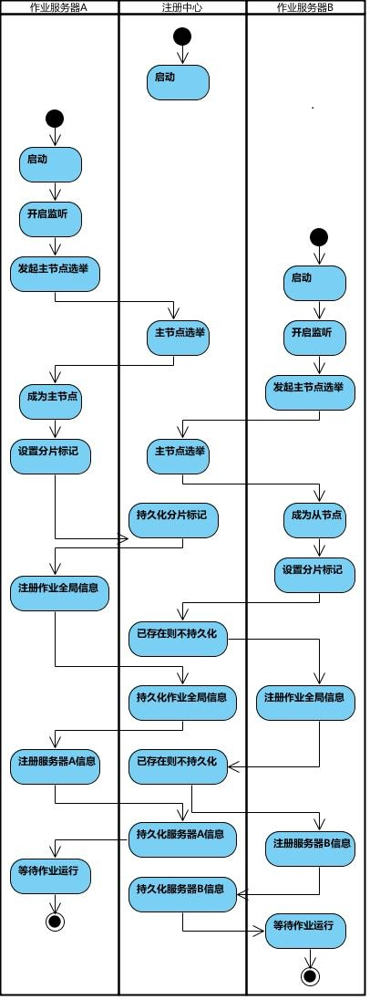
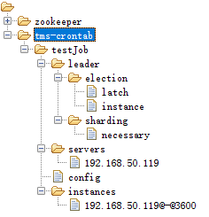
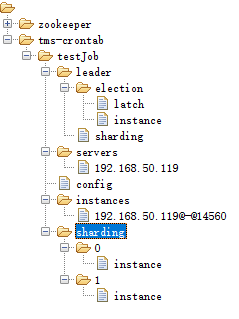
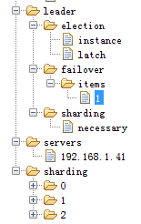
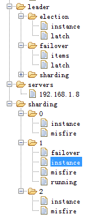

### 一：概述

elastic-job是由当当网开源的一种分布式任务调度框架，由李亮牵头开发的，他们的另外一个开源项目是sharding-jdbc

和xxl-job的中心化调度不同的是，elastic-job采用无中心化设计，核心任务调度逻辑还是采用的quartz，

不过使用的是基于内存的RAMJobStore，这种架构对分布式内存配置数据的一致性有很高要求。

elastic-job采用zookeeper作为分布式协调配置中心的方案。（入坑zk推荐阅读《从Paxos到zookeeper分布式一致性原理与实践》）

### 二：原理

#### 作业启动流程

*   第一台服务器上线触发主服务器选举。主服务器一旦下线，则重新触发选举，选举过程中阻塞，只有主服务器选举完成，才会执行其他任务。

*   某作业服务器上线时会自动将服务器信息注册到注册中心，下线时会自动更新服务器状态。

*   主节点选举，服务器上下线，分片总数变更均会更新重新分片标记。

*   定时任务触发时，如需重新分片，则通过主服务器分片，分片过程中阻塞，分片结束后才可执行任务。如分片过程中主服务器下线，则先选举主服务器，再分片。

*   为了维持作业运行时的稳定性，运行过程中只会标记分片状态，不会重新分片。分片仅可能发生在下次任务触发前。

*   每次分片都会按服务器`IP`排序，保证分片结果不会产生较大波动。

*   实现失效转移功能，在某台服务器执行完毕后主动抓取未分配的分片，并且在某台服务器下线后主动寻找可用的服务器执行任务。

#### 作业执行流程

### 三：实现

比如有两个作业服务器实例，namespace为tms-crontab，内部配置了一个名为testJob的定时任务，分片数为2

#### 启动阶段

当作业服务器A启动时，会去zk创建任务，zk目录数据结构如下

首先会在根目录下创建namespace的目录，即tms-crontab

然后在tms-crontab下创建任务名为testJob的目录

| 目录 | 是否临时节点 | 目录说明 |
-|-|-
| /tms-crontab/testJob/leader | 否 | 用于leader选举，leader的主要作用是分配分片到作业服务器 |
| /tms-crontab/testJob/leader/election/latch | 否 | 主节点选举的分布式锁 |
| /tms-crontab/testJob/leader/election/instance | 是 | leader服务器IP地址一旦该节点被删除将会触发重新选举重新选举的过程中一切主节点相关的操作都将阻塞 |
| /tms-crontab/testJob/leader/sharding/necessary | 否 | 此节点存在表示任务下次执行之前需要让leader做重新分片虽然这个节点不是临时节点，但是它不是一直存在的，重新分片完就会被删除掉如果有新的作业服务器加入到集群中来，或者有作业服务器下线，则会创建这个节点|
| /tms-crontab/testJob/servers/{IP} | 否 | 作业服务器信息，子节点是作业服务器的IP地址。可在IP地址节点写入DISABLED表示该服务器禁用。|
| /tms-crontab/testJob/config | 否 | 存放作业配置信息，json结构 |
| /tms-crontab/testJob/instances/{instanceId} | 是 | 当前作业运行实例的主键。作业运行实例主键由作业运行服务器的IP地址和PID构成。作业运行实例主键均为临时节点，当作业实例上线时注册，下线时自动清理。注册中心监控这些节点的变化来协调分布式作业的分片以及高可用。可在作业运行实例节点写入TRIGGER表示该实例立即执行一次|

在创建这些节点的同时，会注册某些zk目录的监听，比较重要的监听有

| 目录 | 监听类型 | 说明 |
|-|-|-|
| /tms-crontab/testJob/instances | 子节点创建与删除 | 这个目录的子目录发生变化说明有新作业服务器加入或者下线这个时候需要写重新分片标志，即创建/tms-crontab/testJob/leader/sharding/necessary目录|
| /tms-crontab/testJob/leader/election/instance | 删除 | 此临时节点目录被删除说明leader下线，所以要做重新选举leader，选举完之后同样要写重新分片标志 |
| /tms-crontab/testJob/config | 修改 | 此节点内容变化说明任务配置变更了，所有的作业服务都需要更新最新配置到内存如果分片数量配置发生变更，则需要写重新分片标志|
| /tms-crontab/testJob/servers/{IP} | 修改 | 写入DISABLED表示该服务器禁用，变更成任意其他内容说明任务启用 |
| /tms-crontab/testJob/instances/{instanceId} | 修改 | 写入TRIGGER表示该实例立即执行一次，触发之后会清空这个值 |

之后会调用Quartz的API来发布定时任务执行完以上核心逻辑以后，作业服务器A就算启动完成了后面启动作业服务器B当B启动时，发现需要的目录已经创建好了，而且已经有leader节点了，那么B会自动成为从节点，并把本实例写入到/tms-crontab/testJob/instances/instanceB目录下如果重新分片标志目录不存在，就创建该目录，即前面所说的/tms-crontab/testJob/leader/sharding/necessary目录如果作业服务器B的jobTest任务配置是覆盖模式，那么会直接写入该配置到/tms-crontab/testJob/config目录，作业服务器A的监听器会收到此目录修改事件，从而更新自己内存里的配置数据。

作业服务器B启动完成

#### 运行阶段

当任务到达运行时间点，Quartz就会启动该任务

执行逻辑是先去zk查询分片标志是否存在，即是否存在/tms-crontab/testJob/leader/sharding/necessary目录

如果存在，则先让leader做任务分片，按照任务配置的分片数，尽可能均匀的分配给每个作业服务器。

分配完成的zk目录如下

比原先刚启动的时候多了/tms-crontab/testJob/sharding目录，这个目录下的数据结构就是某个分片应该由哪个作业服务器来执行。

分片完成之后，作业服务器会去sharding目录根据自己的instance取对应的分片配置作为任务运行的参数，然后运行业务逻辑。

执行完成之后，如果配置了日志数据库，则会写入任务运行日志。

这样一个定时任务就执行完成了。

#### 失效转移

所谓失效转移，就是在执行任务的过程中遇见异常的情况，这个分片任务可以在其他节点再次执行。

elastic-job的任务配置有个failover，如果开启设置为true的时候且monitorExecution也为true时，才会启动真正的失效转移。

作业服务器监听到zk的instance节点删除事件。如果任务配置了failover等于true，其中某个instance与zk失去联系或被删除，并且失效的节点又不是本身，就会触发失效转移逻辑。

首先，在某个任务实例失效时，elastic-job会在leader节点下面创建failover节点以及items节点。

items节点下会有失效任务实例的原本应该做的分片好。比如，失效的任务实例原来负责分片1。那么items节点下就会有名字叫1的子节点，就代表分片1需要转移到其他节点上去运行。如下图：

然后，由于每个存活着的任务实例都会收到zk节点丢失的事件，哪个分片失效也已经在leader节点的failover子节点下。

所以这些或者的任务实例就会争抢这个分片任务来执行。为了保证不重复执行，elastic-job使用了curator的LeaderLatch类来进行选举执行。

在获得执行权后，就会在sharding节点的分片上添加failover节点，并写上任务实例，表示这个故障任务迁移到某一个任务实例上去完成。如下图中的sharding节点上的分片1：

执行完成后，会把相应的节点和数据删除，避免下一次重复执行。

#### 任务错过

elastic-job的任务错过机制是错过就错过了，不会补偿。从源码来看其实是设置了quartz的org.quartz.jobStore.misfireThreshold配置为1

而且如果配置的任务是1分钟执行一次，但是任务执行时间为10分钟，那么这10分钟内，这个任务不会再触发。等完成之后才会触发下一次，具体的控制逻辑就不细讲了

### 四：优点与缺点

#### 优点

无中心化设计，更容易封装成简单易用的定时任务工具

基于内存的单机RAMJobstore比基于数据库的JobstoreTX更加轻量高效

支持任务分片，支持故障转移

有UI操作界面

代码质量非常高

#### 缺点或缺陷

不支持动态增加任务

不支持一次性延时任务

如果用UI暂停了某个定时任务，把作业服务器重启，那么这个任务又恢复成启动状态了

任务是强制分片执行的，没有随机选择一个作业服务器执行完整业务逻辑的功能。那么使用起来的话，可能只会让分片0执行完整的业务逻辑，而且每次都是固定的作业服务器执行，这样可能会导致某台机器压力大

界面功能比较弱，目前只有日志展示、暂停任务、手工触发一次任务和停止任务的功能

由于是无中心的化的，所以写数据库日志这块比较的蛋疼。如果写本服务配置的数据库，那么会导致很多数据库都有这两张日志表，而且有的服务压根就没数据库。如果是多配置一个数据源，那么很多项目会有两个datasource，挺占资源的。或直接直接不记日志
