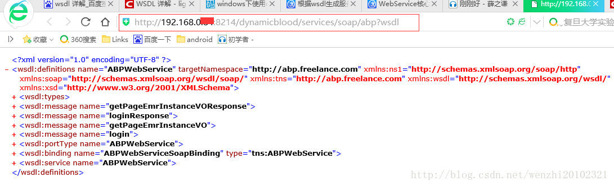
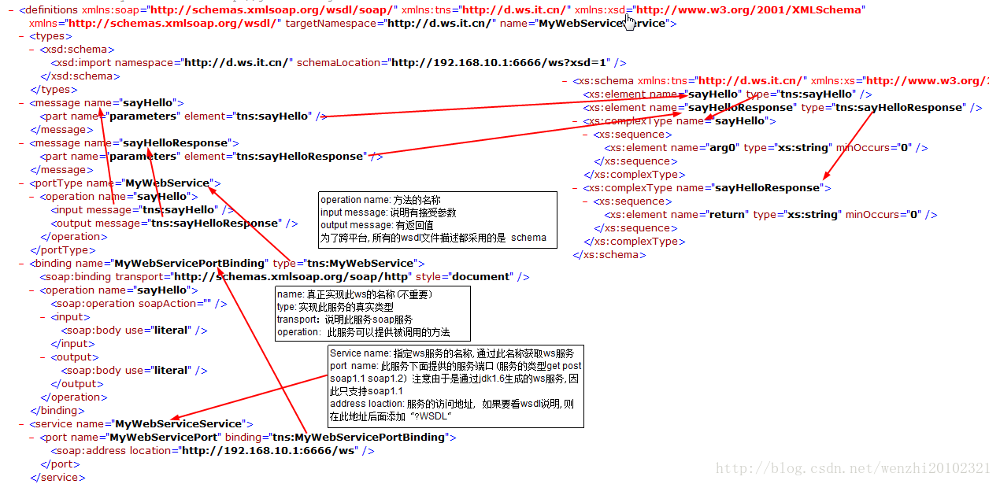
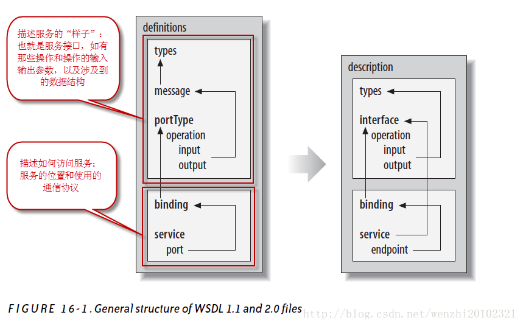

### WebService中的WSDL详解
       有人在WebService开发的时候，特别是和第三方有接口的时候，走的是SOAP协议，然后用户（或后台）给你一个WSDL文件（或网址），说按照上面的进行适配， 这时就要对WebService的WSDL有一定的理解，本文将对WSDL（WebService描述语言）进行详细总结。 
       WSDL (Web Services Description Language,Web服务描述语言)是一种XML Application，他将Web服务描述定义为一组服务访问点，客户端可以通过这些服务访问点对包含面向文档信息或面向过程调用的服务进行访问(类似远程过程调用)。WSDL首先对访问的操作和访问时使用的请求/响应消息进行抽象描述，然后将其绑定到具体的传输协议和消息格式上以最终定义具体部署的服务访问点。相关的具体部署的服务访问点通过组合就成为抽象的Web服务。

一．WSDL的基本概念
       WSDL是一个用于精确描述Web服务的文档，WSDL文档是一个遵循WSDL-XML模式的XML文档。WSDL 文档将Web服务定义为服务访问点或端口的集合。在 WSDL 中，由于服务访问点和消息的抽象定义已从具体的服务部署或数据格式绑定中分离出来，因此可以对抽象定义进行再次使用。消息，指对交换数据的抽象描述；而端口类型，指操作的抽象集合。用于特定端口类型的具体协议和数据格式规范构成了可以再次使用的绑定。将Web访问地址与可再次使用的绑定相关联，可以定义一个端口，而端口的集合则定义为服务。 
       一个WSDL文档通常包含8个重要的元素，即definitions、types、import、message、portType、operation、binding、service元素。这些元素嵌套在definitions元素中，definitions是WSDL文档的根元素。 
WSDL文档外层结构图示：
 

```
WSDL 服务进行交互的基本元素： 
Types（消息类型）：数据类型定义的容器，它使用某种类型系统（如 XSD）。 
Message（消息）：通信数据的抽象类型化定义，它由一个或者多个 part 组成。 
Part：消息参数 
PortType（端口类型）：特定端口类型的具体协议和数据格式规范。，它由一个或者多个 Operation组成。 
Operation（操作）：对服务所支持的操作进行抽象描述，WSDL定义了四种操作： 
1.单向（one-way）：端点接受信息； 
3.要求-响应（solicit-response）：端点发送消息，然后接受相关消息； 
4.通知（notification[2] ）：端点发送消息。

Binding：特定端口类型的具体协议和数据格式规范。 
Port：定义为绑定和网络地址组合的单个端点。 
Service：相关端口的集合，包括其关联的接口、操作、消息等。 
外层结构里面也可能有多层结构。
```


二．WSDL的基本结构详解
下面通过一份wsdl文档，来详细解读WSDL结构：

```
 <?xml version="1.0" encoding="UTF-8" ?>
<wsdl:definitions
    targetNamespace="http://com.liuxiang.xfireDemo/HelloService"
    xmlns:tns="http://com.liuxiang.xfireDemo/HelloService"
    xmlns:wsdlsoap="http://schemas.xmlsoap.org/wsdl/soap/"
    xmlns:soap12="http://www.w3.org/2003/05/soap-envelope"
    xmlns:xsd="http://www.w3.org/2001/XMLSchema"
    xmlns:soapenc11="http://schemas.xmlsoap.org/soap/encoding/"
    xmlns:soapenc12="http://www.w3.org/2003/05/soap-encoding"
    xmlns:soap11="http://schemas.xmlsoap.org/soap/envelope/"
    xmlns:wsdl="http://schemas.xmlsoap.org/wsdl/">
    <wsdl:types>
        <xsd:schema xmlns:xsd="http://www.w3.org/2001/XMLSchema"
            attributeFormDefault="qualified" elementFormDefault="qualified"
            targetNamespace="http://com.liuxiang.xfireDemo/HelloService">
            <xsd:element name="sayHello">
                <xsd:complexType>
                    <xsd:sequence>
                        <xsd:element maxOccurs="1" minOccurs="1"
                            name="name" nillable="true" type="xsd:string" />
                    </xsd:sequence>
                </xsd:complexType>
            </xsd:element>
            <xsd:element name="sayHelloResponse">
                <xsd:complexType>
                    <xsd:sequence>
                        <xsd:element maxOccurs="1" minOccurs="0"
                            name="return" nillable="true" type="xsd:string" />
                    </xsd:sequence>
                </xsd:complexType>
            </xsd:element>
        </xsd:schema>
    </wsdl:types>
    <wsdl:message name="sayHelloResponse">
        <wsdl:part name="parameters" element="tns:sayHelloResponse" />
    </wsdl:message>
    <wsdl:message name="sayHelloRequest">
        <wsdl:part name="parameters" element="tns:sayHello" />
    </wsdl:message>
    <wsdl:portType name="HelloServicePortType">
        <wsdl:operation name="sayHello">
            <wsdl:input name="sayHelloRequest"
                message="tns:sayHelloRequest" />
            <wsdl:output name="sayHelloResponse"
                message="tns:sayHelloResponse" />
        </wsdl:operation>
    </wsdl:portType>
    <wsdl:binding name="HelloServiceHttpBinding"
        type="tns:HelloServicePortType">
        <wsdlsoap:binding style="document"
            transport="http://schemas.xmlsoap.org/soap/http" />
        <wsdl:operation name="sayHello">
            <wsdlsoap:operation soapAction="" />
            <wsdl:input name="sayHelloRequest">
                <wsdlsoap:body use="literal" />
            </wsdl:input>
            <wsdl:output name="sayHelloResponse">
                <wsdlsoap:body use="literal" />
            </wsdl:output>
        </wsdl:operation>
    </wsdl:binding>
    <wsdl:service name="HelloService">
        <wsdl:port name="HelloServiceHttpPort"
            binding="tns:HelloServiceHttpBinding">
            <wsdlsoap:address
                location="http://localhost:8080/xfire/services/HelloService" />
        </wsdl:port>
    </wsdl:service>
</wsdl:definitions>
```


（一） definitions元素
       所有的WSDL文档的根元素均是definitions元素。该元素封装了整个文档，同时通过其name提供了一个WSDL文档。除了提供一个命名空间（targetNamespace）外，该元素没有其他作用，故不作详细描述。

（二）types元素
       WSDL采用了W3C XML模式内置类型作为其基本类型系统。types元素用作一个容器，用于定义XML模式内置类型中没有描述的各种数据类型（不太明白：XML模式内置类型中没有描述的各种数据类型）。当声明消息部分的有效时，消息定义使用了在types元素中定义的数据类型和元素。在本文的WSDL文档中的types定义：
```
<wsdl:types>
        <xsd:schema xmlns:xsd="http://www.w3.org/2001/XMLSchema"
            attributeFormDefault="qualified" elementFormDefault="qualified"
            targetNamespace="http://com.liuxiang.xfireDemo/HelloService">
            <xsd:element name="sayHello">
                <xsd:complexType>
                    <xsd:sequence>
                        <xsd:element maxOccurs="1" minOccurs="1"
                            name="name" nillable="true" type="xsd:string" />
                    </xsd:sequence>
                </xsd:complexType>
            </xsd:element>
            <xsd:element name="sayHelloResponse">
                <xsd:complexType>
                    <xsd:sequence>
                          <xsd:element maxOccurs="1" minOccurs="0"
                            name="return" nillable="true" type="xsd:string" />
                    </xsd:sequence>
                </xsd:complexType>
            </xsd:element>
        </xsd:schema>
    </wsdl:types>

       上面是数据定义部分，该部分定义了两个元素，一个是sayHello，一个是sayHelloResponse： 
       sayHello：定义了一个复杂类型，仅仅包含一个简单的字符串，将来用来描述操作的参入传入部分； 
       sayHelloResponse：定义了一个复杂类型，仅仅包含一个简单的字符串，将来用来描述操作的返回值； 
       这里sayHelloResponse是和sayHello相关的，sayHello相对于一个方法，里面的： type=”xsd:string”，name=”name”，是确定传入name的参数是String类型的，而sayHelloResponse中的 name=”return” type=”xsd:string” 是确定方法sayHello（String name）返回的类型是String类型的。
```

（三）import元素
       import元素使得可以在当前的WSDL文档中使用其他WSDL文档中指定的命名空间中的定义元素。本例子中没有使用import元素。通常在用户希望模块化WSDL文档的时候，该功能是非常有效果的。 
import的格式如下：
```
<wsdl:import namespace="http://xxx.xxx.xxx/xxx/xxx" location="http://xxx.xxx.xxx/xxx/xxx.wsdl"/>
```

必须有namespace属性和location属性： 
1.namespace属性：值必须与正导入的WSDL文档中声明的targetNamespace相匹配； 
2.location属性：必须指向一个实际的WSDL文档，并且该文档不能为空。

（四）message元素
       message元素描述了Web服务使用消息的有效负载。message元素可以描述输出或者接受消息的有效负载；还可以描述SOAP文件头和错误detail元素的内容。定义message元素的方式取决于使用RPC样式还是文档样式的消息传递。在本文中的message元素的定义，本文档使用了采用文档样式的消息传递：
```
<wsdl:message name="sayHelloResponse">
        <wsdl:part name="parameters" element="tns:sayHelloResponse" />
    </wsdl:message>
    <wsdl:message name="sayHelloRequest">
        <wsdl:part name="parameters" element="tns:sayHello" />
    </wsdl:message>

```
       
       该部分是消息格式的抽象定义：定义了两个消息sayHelloResponse和sayHelloRequest：

1.sayHelloRequest：
sayHello操作的请求消息格式，由一个消息片断组成，名字为parameters,元素是我们前面定义的types中的元素；

2.sayHelloResponse：
sayHello操作的响应消息格式，由一个消息片断组成，名字为parameters,元素是我们前面定义的types中的元素； 
        如果采用RPC样式的消息传递，只需要将文档中的element元素修改为type即可（？？）。

（五）portType元素
       portType元素定义了Web服务的抽象接口。该接口有点类似Java的接口，都是定义了一个抽象类型和方法，没有定义实现。在WSDL中，portType元素是由binding和service元素来实现的，这两个元素用来说明Web服务实现使用的Internet协议、编码方案以及Internet地址。 
一个portType中可以定义多个operation，一个operation可以看作是一个方法，本文中WSDL文档的定义：
```
<wsdl:portType name="HelloServicePortType">
        <wsdl:operation name="sayHello">
            <wsdl:input name="sayHelloRequest"
                message="tns:sayHelloRequest" />
            <wsdl:output name="sayHelloResponse"
                message="tns:sayHelloResponse" />
        </wsdl:operation>
    </wsdl:portType>
```
    
    portType定义了服务的调用模式的类型，这里包含一个操作sayHello方法，同时包含input和output表明该操作是一个请求／响应模式，请求消息是前面定义的sayHelloRequest，响应消息是前面定义的sayHelloResponse。input表示传递到Web服务的有效负载，output消息表示传递给客户的有效负载。 
       这里相当于抽象类中定义了一个抽象方法sayHello，而方法参数的定义和返回值的定义都是在types中设置的，方法名又是在message中定义有的。

（六）binding
       binding元素将一个抽象portType映射到一组具体协议(SOAO和HTTP)、消息传递样式、编码样式。通常binding元素与协议专有的元素和在一起使用，本文中的例子：
```
<wsdl:binding name="HelloServiceHttpBinding"
        type="tns:HelloServicePortType">
        <wsdlsoap:binding style="document"
            transport="http://schemas.xmlsoap.org/soap/http" />
        <wsdl:operation name="sayHello">
            <wsdlsoap:operation soapAction="" />
            <wsdl:input name="sayHelloRequest">
                <wsdlsoap:body use="literal" />
            </wsdl:input>
            <wsdl:output name="sayHelloResponse">
                <wsdlsoap:body use="literal" />
            </wsdl:output>
        </wsdl:operation>
    </wsdl:binding>
```
    
      这部分将服务访问点的抽象定义与SOAP、HTTP绑定，描述如何通过SOAP/HTTP来访问按照前面描述的访问入口点类型部署的访问入口。 
其中规定了在具体SOAP调用时，应当使用的soapAction是”xxx”，这个Action在WebService代码调用中是很重要的。具体的使用需要参考特定协议定义的元素。

（七）service元素和port元素
       service元素包含一个或者多个port元素，其中每个port元素表示一个不同的Web服务。port元素将URL赋给一个特定的binding，甚至可以使两个或者多个port元素将不同的URL赋值给相同的binding。文档中的例子：

```
<wsdl:service name="HelloService">
        <wsdl:port name="HelloServiceHttpPort"
            binding="tns:HelloServiceHttpBinding">
            <wsdlsoap:address
                location="http://localhost:8080/xfire/services/HelloService" />
        </wsdl:port>
    </wsdl:service>
```
     
     对于这个WSDL文档的学习，第一次看是感觉非常陌生的，而且里面元素又多，学习的话先是要了解外层结构代表的意义和作用，然后理解里面的元素的意义和作用，有些元素作用不大，有些元素又是很关联的，有些元素是比较重要的。 
WSDL图解： 



